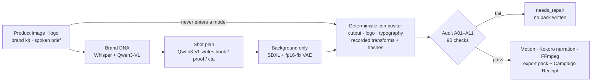

<div align="center">


# Rivet

[](LICENSE)


[](https://rivet-amd.vercel.app)


### Verified ad creation on one AMD Radeon GPU. **The model never touches the product.**

A product image, brand kit and spoken brief become a three-scene vertical advertisement — where the product, logo and text are composited deterministically from your files *after* generation, and **every export is checked against named audit checks before it is allowed to exist**. Fail one, and no pack is written.

Compositing a logo deterministically is table stakes; several tools do that much. The question none of them answer is *how you know it worked*. Rivet answers it, and **a refusal reproduces exactly like a pass**.

**[ Live studio ↗ ](https://rivet-amd.vercel.app)** · **[ The audit ↗ ](#the-audit-eleven-checks-every-scene)** · **[ Verify it yourself ↗ ](#verify-it-yourself-in-60-seconds)** · **[ Results ↗ ](#results)** · **[ Run it locally ↗ ](#install)**

Built for the **AMD AI DevMaster Hackathon 2026** — Track 1: Multimodal Content Creation Tools, on a Radeon PRO W7900 · 48 GB · ROCm 7.2.1.

</div>

---

## ▶ Demo

<p align="center">
  
  
  
</p>

**Left and centre: a verified export. Right: the same advertisement, refused.** The product file was altered after the brand approved it. A01 compared the confirmed sha256 against the bytes actually composited, failed, and no export pack was written. Both are real output from the W7900 — see [docs/gallery/](docs/gallery/).

## Table of contents

- [The problem](#the-problem)
- [Why it is different](#why-it-is-different)
- [The audit — eleven checks, every scene](#the-audit-eleven-checks-every-scene)
- [Verify it yourself in 60 seconds](#verify-it-yourself-in-60-seconds)
- [Results](#results)
- [Architecture](#architecture)
- [Six languages, audited in the language they ship in](#six-languages-audited-in-the-language-they-ship-in)
- [Requirements](#requirements) · [Install](#install) · [Models](#models)
- [Make an advertisement](#make-an-advertisement)
- [Commands](#commands)
- [Benchmarks](#benchmarks)
- [Adapting to the Radeon PRO W7900](#adapting-to-the-radeon-pro-w7900)
- [What's real vs simplified — the honesty table](#whats-real-vs-simplified--the-honesty-table)
- [Engineering decisions & the bugs that taught something](#engineering-decisions--the-bugs-that-taught-something)
- [Layout](#layout) · [Troubleshooting](#troubleshooting) · [License](#license)

---

## The problem

Someone selling handmade soap can generate fifty advertisements tonight. If one says "clinically proven" — because a language model reached for a phrase that sounded like marketing — that is a fine they cannot absorb, and there is no legal team standing between them and it. A large brand has a review process. They have a phone.

Generative tools made advertising cheap without making *checking* it cheap, so the check stayed with whoever could afford a reviewer. Rivet moves it into the tool: every asset is audited as it is made, and one that fails is refused rather than shipped.

## Why it is different

Most generative ad tools ask you to trust the output. Rivet proves it.

1. **Protected layers never pass through a generative model.** The product cutout, logo and final typography are composited deterministically from your source assets *after* generation, with recorded transforms and hashes. The model is creative only where creativity is safe: the background.
2. **Evidence before claims.** Every export carries a **Campaign Receipt** — input hashes, seeds, per-stage wall time, peak VRAM, audit results and any repairs — plus a manifest that hashes every file in the pack.
3. **A failing export does not exist.** The pipeline does not warn and continue. It withholds the pack and moves the project to `needs_repair`.

## The audit — eleven checks, every scene

Ten deterministic checks plus one advisory run on every scene, in all three formats — **90 checks per campaign**. A deterministic failure blocks the export.

| Check | Verifies |
|---|---|
| A01 | the product and logo used match the brand-confirmed assets, by sha256 |
| A02 | the logo in the frame matches the source logo, pixel for pixel |
| A03 | rendered copy equals approved copy |
| A04 | background colour stays on-brand |
| A05 | safe-area geometry, and that no text overflowed its box |
| A06 | the product occupies enough of the frame |
| A07 | no forbidden claims, all required phrases present — including narration |
| A09 | the product in the frame matches the cutout, pixel for pixel |
| A10 | text contrast is legible against what is actually behind it |
| A11 | every rendered character exists in the font that drew it |
| A08 | *(advisory)* semantic fit, judged by Qwen3-VL — never blocks an export |

Checks are **named, with observed values and thresholds** — not a score. The receipt records that A02 saw a mean pixel difference of 9.3 against a threshold of 40, not that the logo "looked right".

## Verify it yourself in 60 seconds

Every claim in this README is produced by a command in this repository:

```bash
make submission-check
# → checking 279 tracked files
#   [  ok] required deliverables present
#   [  ok] internal planning files excluded
#   [  ok] no secrets in tracked files
#   [  ok] every model has a license row
#   [  ok] no tracked file over 50 MB
#   submission-check: pass

uv run pytest -q                  # → 277 passed
make test-golden                  # byte-identical compositing, stable receipt hashes
make offline-demo                 # whole pipeline, every outbound socket blocked
make benchmark-cold FIXTURE=fixtures/kora-arc
```

The benchmark writes JSON, CSV and Markdown to [docs/benchmarks/](docs/benchmarks/) with per-stage wall time, peak VRAM, device and library versions. **The numbers below regenerate from that command** — they are not transcribed from a screenshot.

## Results

| | |
|---|---|
| **Verified and refused** | [docs/gallery/](docs/gallery/) — a passing campaign and the same campaign blocked by A01 |
| **Three brands, one pipeline** | [DIVERSITY.md](docs/gallery/DIVERSITY.md) — a speaker, an insulated flask, a coffee press. Nothing configured per brand; each palette is derived from its own logo |
| **Three formats** | story 1080×1920, feed 1080×1080, banner 1920×1080 — each with its own geometry, each audited separately |
| **Mandarin** | [LANGUAGE-ZH.md](docs/gallery/LANGUAGE-ZH.md) — written in Chinese rather than translated, narrated by a Mandarin voice, claims audited as written |

## Architecture

Protected assets route **around** the generative path. That is the whole design.



- **SAM 2.1** cuts the product out; the cutout is composited from *your* pixels, never redrawn.
- **The compositor** is pure Pillow with packaged fonts — no system font can change an output.
- **The audit runs before motion and narration**, so a certified still is the still the video contains.
- **One heavy model is resident at a time**, enforced by a residency scheduler rather than convention.

## Six languages, audited in the language they ship in

`en · es · fr · it · pt · zh` — each language carries its own Kokoro voice, its own packaged font, and its own speech rate, because a second of Mandarin carries far fewer characters than a second of Portuguese.

Narrating in Portuguese while auditing an English claim list would verify nothing, so the language drives the voice, the typography **and the claims the audit reads**. A language whose font cannot draw its script is rejected at validation rather than rendered as empty boxes — see A11.

```bash
uv run python scripts/showcase.py --language zh
```

## Requirements

- Python 3.11+ and [uv](https://docs.astral.sh/uv/)
- FFmpeg on `PATH`
- Node 20+ (only for the web UI)
- For GPU inference: a ROCm-capable Radeon GPU. The pipeline also runs on CPU and Apple MPS for development.

## Install

```bash
uv sync                      # core, CPU-only
uv sync --extra gpu          # adds torch, diffusers, transformers, kokoro
cd apps/web && npm install && cd ../..
make doctor                  # verifies python, ffmpeg and the torch device
```

On a Radeon cloud instance, `./install.sh` does the whole thing — and **aborts if installing anything replaced the ROCm build of torch**, which is the failure that otherwise turns a GPU run into a silent CPU run.

### Models

Weights are **not** bundled. Download them once, then the pipeline runs entirely from the local cache — `make offline-demo` proves it by blocking every outbound socket.

```bash
uv run python scripts/models/smoke.py     # probes each model and reports what is cached
```

| Model | Used for |
|---|---|
| `stabilityai/stable-diffusion-xl-base-1.0` (+ `madebyollin/sdxl-vae-fp16-fix`) | scene backgrounds |
| `Qwen/Qwen3-VL-4B-Instruct` | scene planning and the advisory A08 audit |
| `facebook/sam2.1-hiera-small` | product cutout when the source needs segmentation |
| `hexgrad/Kokoro-82M` | narration in every supported language |
| `openai/whisper-tiny.en` | spoken brief transcription |

Every model, font and demo asset is recorded with its license in [MODEL_LICENSES.md](MODEL_LICENSES.md). Revisions are pinned by commit hash.

## Make an advertisement

```bash
PID=$(uv run rivet create "Kora Arc" --seed 7)
uv run rivet ingest "$PID" fixtures/kora-arc/product.png fixtures/kora-arc/logo.png \
  --brief "A portable speaker for campus creators who record anywhere"
uv run rivet plan "$PID"        # Qwen3-VL writes distinct hook/proof/cta copy
uv run rivet run "$PID"         # generate, audit, repair, render, pack
uv run rivet export "$PID" ./out
```

`run` prints every check as it is decided and exits non-zero if the audit fails, so it is safe in CI. The export pack contains the MP4, the stills, the SRT captions, `receipt.json` and a `manifest.json` hashing every member.

`rivet plan --no-vlm` falls back to the heuristic planner and `rivet run --no-semantic` skips the advisory A08 judge; both make runs faster and avoid loading Qwen3-VL.

## Commands

```bash
make doctor            # environment check
make dev               # FastAPI on :8000 + web studio on :5173
make test              # unit + integration
make test-golden       # determinism: byte-identical compositing and stable receipt hashes
make lint              # ruff + mypy + eslint
make benchmark-cold FIXTURE=fixtures/kora-arc
make benchmark-hot  FIXTURE=fixtures/kora-arc
make offline-demo      # golden project with every outbound socket blocked (gate G2)
make submission-check  # deliverables, secrets, licenses, file sizes
```

## Benchmarks

Two honesty rules are built into the harness:

- **Peak VRAM is only reported where a true per-stage peak exists** (`torch.cuda.max_memory_allocated`, reset before each stage — i.e. ROCm/CUDA). On other devices it reads `n/a` rather than printing a process-wide number that looks like evidence. Every report states its `vram_metric`.
- **Determinism compares content, not identifiers.** Each run is digested over the still bytes, the seeds and the deterministic audit observations, so the comparison cannot be satisfied by run-specific paths or ids.

### Measured on the Radeon PRO W7900

gfx1100 · 49136 MB · ROCm 7.2.53211 · PyTorch 2.9.1 · fixture `kora-arc`

| | seconds | audit |
|---|---:|---|
| Cold — plan, generate, audit, render, pack | **71.7** | 90/90 |
| Hot — models already resident | **45.4** | 90/90 |
| Offline, every outbound socket blocked | — | 90/90, 0 outbound attempts |

Peak VRAM **9168 MB of 49136**: one heavy model is held at a time, leaving 81% of the card free.

**Model residency** — SDXL was rebuilt from disk for every scene. Holding one model resident and releasing it only when a different one is needed is **13.7s faster (24% end to end)**: median 42.2s resident against 55.8s reloading, over alternating arms after a discarded warmup. Set `RIVET_MODEL_RESIDENCY=0` to disable it.

**Determinism** — the content digest `347606b58a93ba16` is identical across all eleven runs above, including both residency arms.

Full reports are in [docs/benchmarks/](docs/benchmarks/); raw run logs in [docs/evidence/](docs/evidence/). Figures measured on a development machine are not comparable and are never quoted as results.

## Adapting to the Radeon PRO W7900

The full account is in [docs/profile.md](docs/profile.md). The parts that cost the most to learn:

- **The ROCm torch is not replaceable.** Any dependency resolution that installs `torch` transitively pulls the CPU wheel over the ROCm one, the GPU disappears, and the pipeline keeps running silently on the CPU. `install.sh` records the version before, re-reads it after, and aborts if it changed. It also selects the interpreter that *owns* the ROCm torch — on the contest image, `python3` is a different interpreter.
- **SDXL's own VAE overflows in fp16** and decodes to black. Pinning `sdxl-vae-fp16-fix` keeps the whole generation path half precision. The model fetcher special-cases that repository: everywhere else it skips duplicate weight formats, but there `diffusion_pytorch_model.safetensors` *is* the model.
- **SDXL attention runs through ROCm's AOTriton** efficient-attention path on gfx1100, not a generic fallback.
- **Kokoro resolves a different phoneme toolchain per language** and fetches it on first use, which fails offline *after* the GPU work is spent. Both the spaCy model and `misaki[zh]` are pinned at install time.

## What's real vs simplified — the honesty table

| Capability | Status |
|---|---|
| **Protected layers never enter a model** | Real. Cutout, logo and typography composited from source bytes; A01/A02/A09 verify it per scene. |
| **Eleven checks per scene, 90 per campaign** | Real. Named checks with observed values and thresholds, in the receipt. |
| **A failing export is withheld** | Real. No pack written, project moves to `needs_repair`. Demonstrated in [docs/gallery/](docs/gallery/). |
| **Campaign Receipt** | Real. Input hashes, model revisions, seeds, per-stage wall time, peak VRAM, every check, hashed as one record. |
| **Determinism** | Real. Content digest identical across eleven runs; `make test-golden` asserts byte-identical compositing. |
| **Offline operation** | Real. `make offline-demo` blocks every socket at the Python layer; 0 connection attempts. |
| **Six languages** | Real for the pipeline. **Demonstrated end to end in English, Portuguese and Mandarin**; Spanish, French and Italian share the Latin font and an untested-in-campaign voice. |
| **Targeted repair** | Real for copy violations (A07): the offending phrase is rewritten and the scene re-composited and re-audited. Layout and colour failures block rather than self-heal. |
| **A08 semantic judge** | Advisory by design. Qwen3-VL scores fit; it never blocks an export, because a model's opinion is not evidence. |
| Motion | Deterministic Ken Burns-style transforms over the composited still, not a video diffusion model. |
| Brand DNA extraction | Palette from the logo + Qwen3-VL reading the product; not a full brand-guideline parser. |
| Not built (never faked) | Multi-user accounts · cloud rendering · A/B performance prediction · video-diffusion motion. |

## Engineering decisions & the bugs that taught something

The rule I refused to break: **never publish a number I did not measure, and never claim a check that does not run.** These are the failures that shaped the design.

- **The lineage check was tautological.** A01 originally compared the product hash to itself — it could never fail. It now compares the sha256 the brand *confirmed* against the sha256 of the file actually composited, which is the only version of that check worth having. The tampered-export demo exists because the fixed check can fail.
- **The audit certified stills the video did not contain.** Repair ran *after* rendering, so a scene could be fixed, certified, and shipped alongside a video built from the unfixed still. Audit and repair now complete before motion and narration.
- **A05 checked constants instead of copy.** It validated the layout template's geometry, not the text actually rendered into it — so an overflowing headline passed. It now re-runs the compositor's fit on the real copy, at the real font size.
- **The residency benchmark measured run order.** The first A/B said residency was 4.4s *slower*. It was: the first arm paid every cold cost. Discarded, re-run with alternating arms after a thrown-away warmup — 13.7s faster. The wrong number was never published.
- **A diffusion model cannot read `#1784B0`.** Background prompts passed hex codes, so A04 measured 175° of hue drift from the brand palette. Naming the colours ("teal", "amber") walked it to clean.
- **Mandarin passed every check and rendered as empty boxes.** The narration stage was told the campaign language; the compositor was not, so Kokoro spoke Chinese while Pillow typeset it in a Latin font. Nothing compared a rendered character against the placeholder a font falls back to. A11 now refuses copy the font cannot draw, and a test asserts every language-bearing stage is told the language — it fails without the wiring.
- **`en_core_web_sm` was installed mid-generation.** Kokoro fetched a spaCy model on first use, which broke the offline gate halfway through a run, after the GPU work was already spent. Pinned at install time; the same failure class returned for Mandarin and was fixed the same way.
- **A partial upload is never a complete asset.** Ingested source files — the ones every protected layer and every hash depends on — are written temp-file → fsync → rename, so an interrupted write cannot become the product a campaign is built from.

## Layout

```
rivet/
├── apps/web/                 # React creator studio
├── services/api/             # FastAPI routes, SSE, local-only server
├── rivet/
│   ├── domain/  pipeline/  adapters/  compositor/
│   ├── audit/  render/  telemetry/  storage/
├── cli/                      # the rivet command group
├── tests/{unit,integration,golden}/
├── fixtures/kora-arc/        # licensed fictional demo brand
└── scripts/{models,benchmark}/
```

## Troubleshooting

**`make doctor` reports torch missing** — expected without `uv sync --extra gpu`. The deterministic compositor, audit and receipt still run; only the generative stages need torch.

**FFmpeg not found** — `brew install ffmpeg` or `apt install ffmpeg`. Motion, assembly and captions all shell out to it.

**A model fails to load offline** — models load from the cached snapshot directory. If a download was interrupted the snapshot may be incomplete; re-run the download and retry.

**The audit blocks the export** — that is the product working. `receipt.json` names the failing check and what it observed; the project moves to `needs_repair` and no pack is written.

## License

MIT — see [LICENSE](LICENSE). Model weights, fonts and demo assets keep their own licenses, recorded in [MODEL_LICENSES.md](MODEL_LICENSES.md). Kora Arc is a fictional brand created for this demo.
