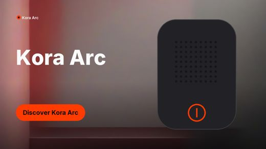

# Rivet

**Verified multimodal ad creation on one AMD Radeon GPU.**

A product image, brand kit and spoken brief become a verified three-scene vertical advertisement — without allowing AI to distort the product, logo or text.

Built for the AMD AI DevMaster Hackathon 2026 (Track 1: Multimodal Content Creation Tools) on a Radeon PRO W7900 · 48GB · ROCm 7.2.1.

<p align="center">
  
  
  
</p>

**Live studio, nothing to install: [rivet-amd.vercel.app](https://rivet-amd.vercel.app)**

**Left and centre: a verified export.** **Right: the same advertisement, refused.** The product
file was altered after the brand approved it; A01 compared the confirmed sha256 against the bytes
actually composited, failed, and no export pack was written. Both runs are real output from the
W7900 — see [docs/gallery/](docs/gallery/).

| Measured on the W7900 | |
|---|---|
| Full campaign, cold | **67.8s** — plan, generate, audit, render, pack |
| Same work, models resident | **41.2s** |
| Deterministic checks | **27/27** across three scenes |
| Peak VRAM | 9168 MB of 49136 |
| Offline, every socket blocked | **passes** |

## Why it is different

Most generative ad tools ask you to trust the output. Rivet proves it.

1. **Protected layers never pass through a generative model.** The product cutout, logo and final typography are composited deterministically from your source assets *after* generation, with recorded transforms and hashes. The model is creative only where creativity is safe: the background.
2. **Evidence before claims.** Every export carries a **Campaign Receipt** — input hashes, seeds, per-stage wall time, audit results and any repairs — plus a manifest that hashes every file in the pack.

Ten checks run on every scene. If a deterministic check fails, the export is blocked and the project moves to `needs_repair` rather than shipping.

| Check | Verifies |
|---|---|
| A01 | the product and logo used match the brand-confirmed assets, by sha256 |
| A02 | the logo in the frame matches the source logo, pixel for pixel |
| A03 | rendered copy equals approved copy |
| A04 | background colour stays on-brand |
| A05 | safe-area geometry, and that no text overflowed its box |
| A06 | the product occupies enough of the frame |
| A07 | no forbidden claims, all required phrases present — including narration |
| A09 | the product in the frame matches the cutout, pixel for pixel |
| A10 | text contrast is legible against what is actually behind it |
| A08 | *(advisory)* semantic fit, judged by Qwen3-VL — never blocks an export |

## Requirements

- Python 3.11+ and [uv](https://docs.astral.sh/uv/)
- FFmpeg on `PATH`
- Node 20+ (only for the web UI)
- For GPU inference: a ROCm-capable Radeon GPU. The pipeline also runs on CPU and Apple MPS for development.

## Install

```bash
uv sync                      # core, CPU-only
uv sync --extra gpu          # adds torch, diffusers, transformers, kokoro
cd apps/web && npm install && cd ../..
make doctor                  # verifies python, ffmpeg and the torch device
```

### Models

Weights are **not** bundled. Download them once, then the pipeline runs entirely from the local
cache — `make offline-demo` proves it by blocking every outbound socket.

```bash
uv run python scripts/models/smoke.py     # probes each model and reports what is cached
```

| Model | Used for |
|---|---|
| `stabilityai/stable-diffusion-xl-base-1.0` (+ `madebyollin/sdxl-vae-fp16-fix`) | scene backgrounds |
| `Qwen/Qwen3-VL-4B-Instruct` | scene planning and the advisory A08 audit |
| `facebook/sam2.1-hiera-small` | product cutout when the source needs segmentation |
| `hexgrad/Kokoro-82M` | narration |
| `openai/whisper-tiny.en` | spoken brief transcription |

Every model, font and demo asset is recorded with its license in [MODEL_LICENSES.md](MODEL_LICENSES.md).

## Make an advertisement

```bash
PID=$(uv run rivet create "Kora Arc" --seed 7)
uv run rivet ingest "$PID" fixtures/kora-arc/product.png fixtures/kora-arc/logo.png \
  --brief "A portable speaker for campus creators who record anywhere"
uv run rivet plan "$PID"        # Qwen3-VL writes distinct hook/proof/cta copy
uv run rivet run "$PID"         # generate, audit, repair, render, pack
uv run rivet export "$PID" ./out
```

`run` prints every check as it is decided and exits non-zero if the audit fails, so it is safe in CI.
The export pack contains the MP4, the three stills, the SRT captions, `receipt.json` and a
`manifest.json` hashing every member.

`rivet plan --no-vlm` falls back to the heuristic planner and `rivet run --no-semantic` skips the
advisory A08 judge; both make runs faster and avoid loading Qwen3-VL.

## Commands

```bash
make doctor            # environment check
make dev               # FastAPI on :8000 + web studio on :5173
make test              # unit + integration
make test-golden       # determinism: byte-identical compositing and stable receipt hashes
make lint              # ruff + mypy + eslint
make benchmark-cold FIXTURE=fixtures/kora-arc
make benchmark-hot  FIXTURE=fixtures/kora-arc
make offline-demo      # golden project with every outbound socket blocked (gate G2)
```

## Benchmarks

`rivet benchmark` runs the fixture end to end and writes JSON, CSV and Markdown to `docs/benchmarks/`,
recording per-stage wall time, peak VRAM, the device and library versions.

```bash
uv run rivet benchmark --fixture fixtures/kora-arc --mode hot --repeat 3
```

Two honesty rules are built into the harness:

- **Peak VRAM is only reported where a true per-stage peak exists** (`torch.cuda.max_memory_allocated`,
  reset before each stage — i.e. ROCm/CUDA). On other devices it reads `n/a` rather than printing a
  process-wide number that looks like evidence. Every report states its `vram_metric`.
- **Determinism compares content, not identifiers.** Each run is digested over the still bytes, the
  seeds and the deterministic audit observations, so the comparison cannot be satisfied by
  run-specific paths or ids. `hot` mode runs twice and reports whether those digests match.

### Measured on the Radeon PRO W7900

gfx1100 · 49136 MB · ROCm 7.2.53211 · PyTorch 2.9.1 · fixture `kora-arc`

| | seconds | audit |
|---|---:|---|
| Cold — plan, generate, audit, render, pack | **67.8** | 27/27 |
| Hot — models already resident | **41.2** | 27/27 |
| Offline, every outbound socket blocked | 67 | 27/27 |

Peak VRAM **9168 MB of 49136**: one heavy model is held at a time, leaving 81% of the card free.

**Model residency** — SDXL was rebuilt from disk for every scene. Holding one model resident and
releasing it only when a different one is needed is **13.7s faster (24% end to end)**: median 42.2s
resident against 55.8s reloading, over alternating arms after a discarded warmup. Set
`RIVET_MODEL_RESIDENCY=0` to disable it.

**Determinism** — the content digest `347606b58a93ba16` is identical across all eleven runs above,
including both residency arms.

Full reports, including per-stage timings and peak VRAM, are in [docs/benchmarks/](docs/benchmarks/);
the raw run logs are in [docs/evidence/](docs/evidence/).

Figures measured on a development machine are not comparable and are never quoted as results.

## Layout

```
rivet/
├── apps/web/                 # React creator studio
├── services/api/             # FastAPI routes, SSE, local-only server
├── rivet/
│   ├── domain/  pipeline/  adapters/  compositor/
│   ├── audit/  render/  telemetry/  storage/
├── cli/                      # the rivet command group
├── tests/{unit,integration,golden}/
├── fixtures/kora-arc/        # licensed fictional demo brand
└── scripts/{models,benchmark}/
```

## Troubleshooting

**`make doctor` reports torch missing** — expected without `uv sync --extra gpu`. The deterministic
compositor, audit and receipt still run; only the generative stages need torch.

**FFmpeg not found** — `brew install ffmpeg` or `apt install ffmpeg`. Motion, assembly and captions
all shell out to it.

**A model fails to load offline** — models load from the cached snapshot directory. If a download was
interrupted the snapshot may be incomplete; re-run the download and retry.

**The audit blocks the export** — that is the product working. `receipt.json` names the failing check
and what it observed; the project moves to `needs_repair` and no pack is written.

## License

Source is released under [LICENSE](LICENSE). Model weights, fonts and demo assets keep their own
licenses, recorded in [MODEL_LICENSES.md](MODEL_LICENSES.md). Kora Arc is a fictional brand created
for this demo.
