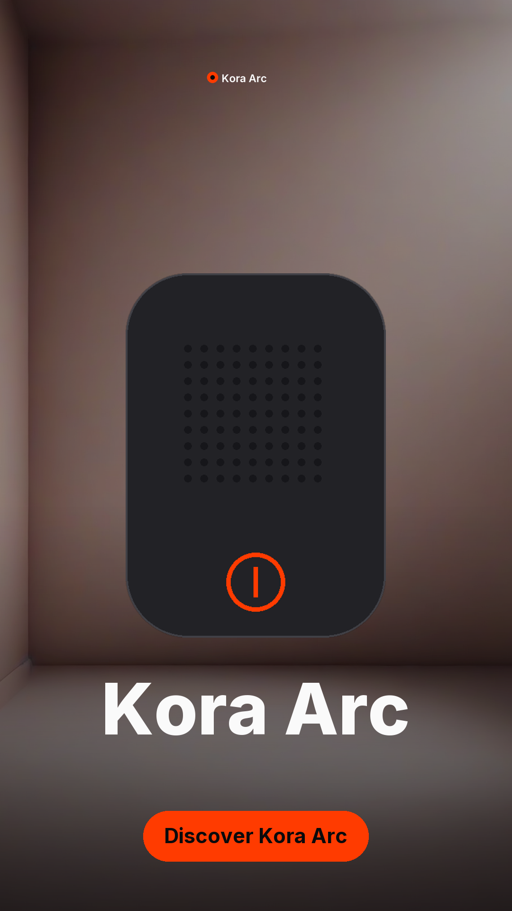
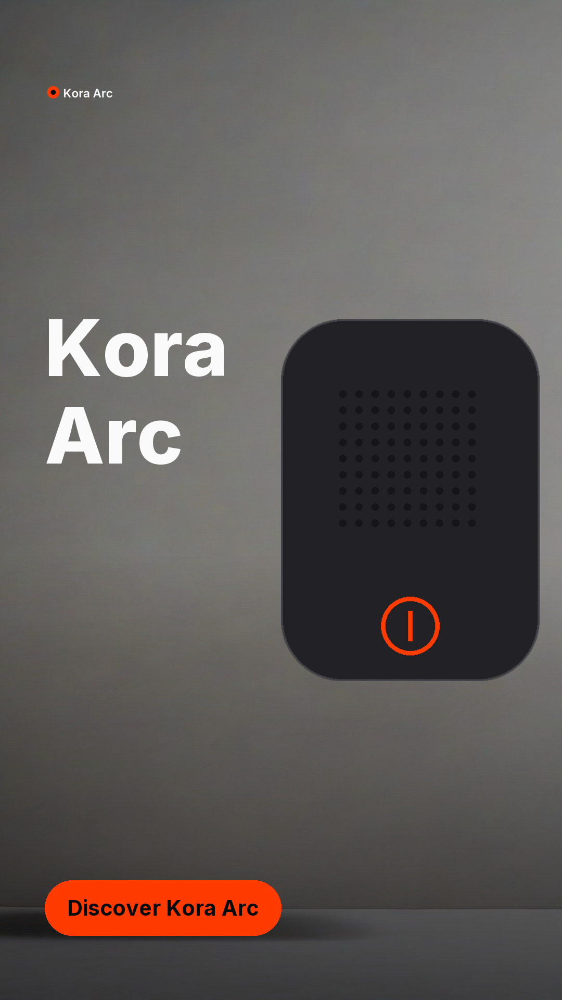
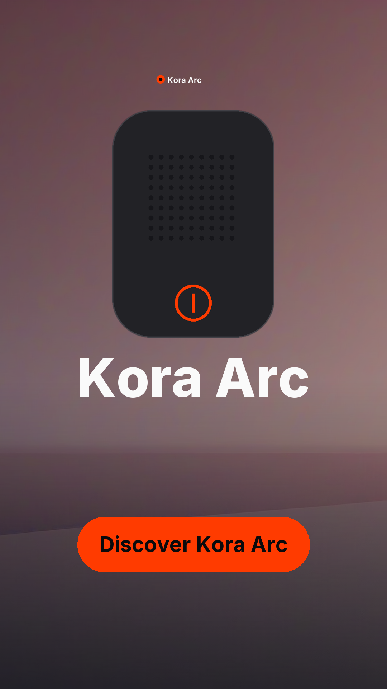
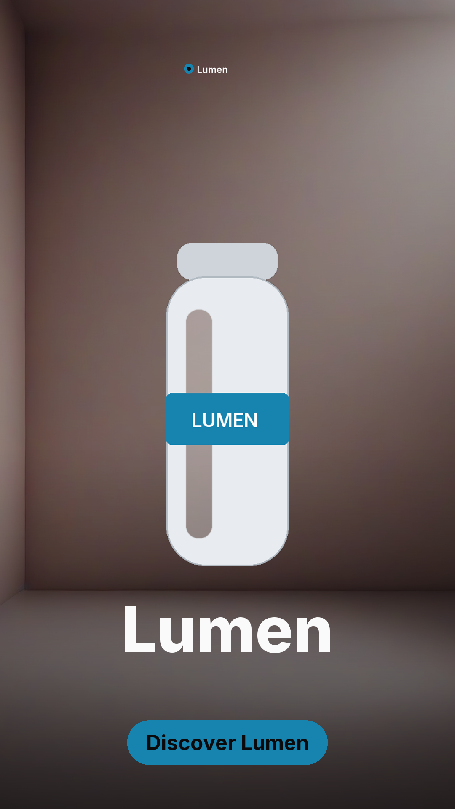
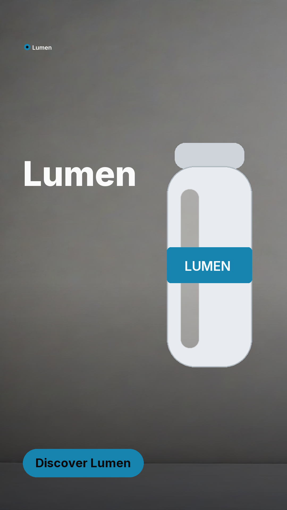
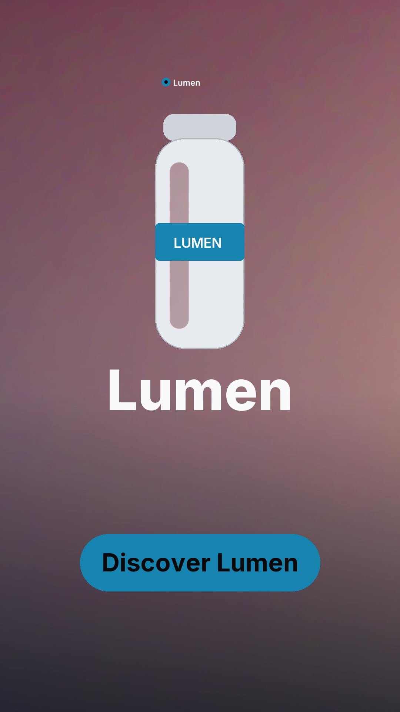
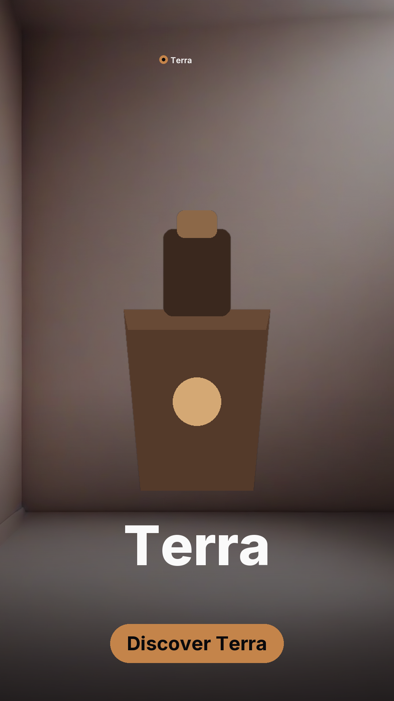
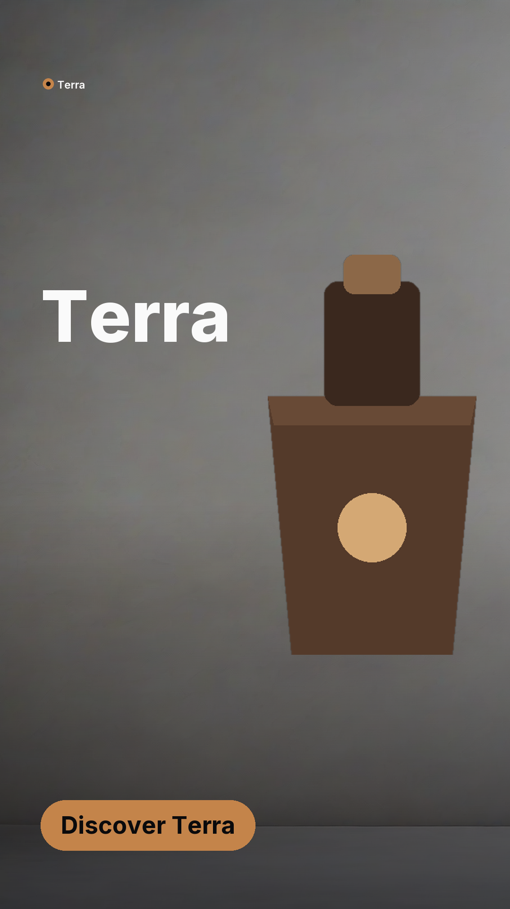
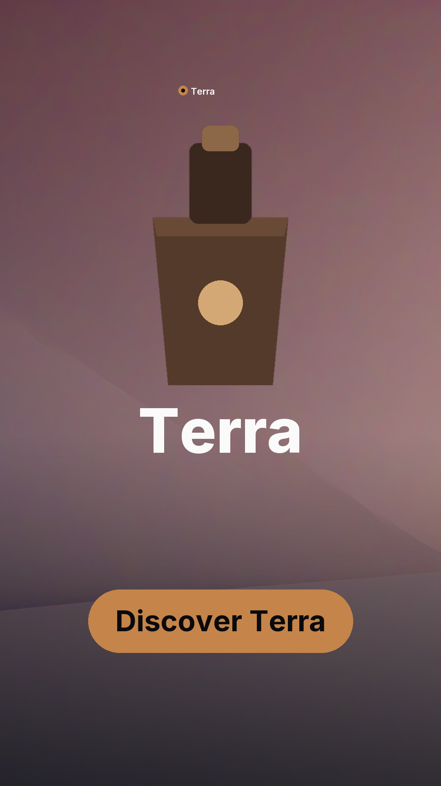

# One pipeline, three brands

Produced by `scripts/diversity.py` on **mps** (torch 2.13.0, hip n/a).

Nothing is configured per brand. The palette is derived from each logo, the copy and
background prompts are written per product, and the same ten checks gate every scene.

| Brand | Verdict | Checks | Receipt |
| --- | --- | ---: | --- |
| Kora Arc | verified | 27/27 | `ef5835c1af91ecb5` |
| Lumen | blocked | 26/27 | `7f6e2f07f9ac8b1d` |
| Terra | verified | 27/27 | `5a4f794fc42591dd` |

### Kora Arc

### Lumen

### Terra

