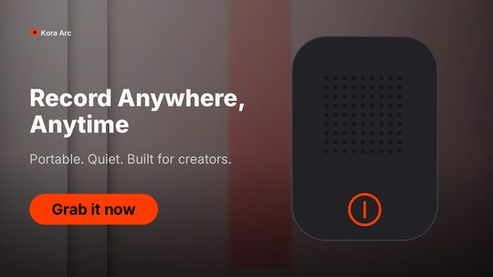
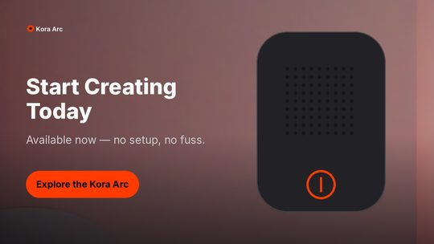
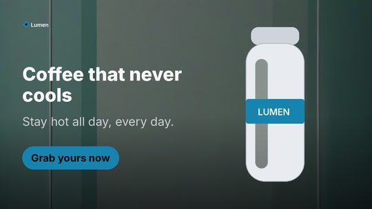
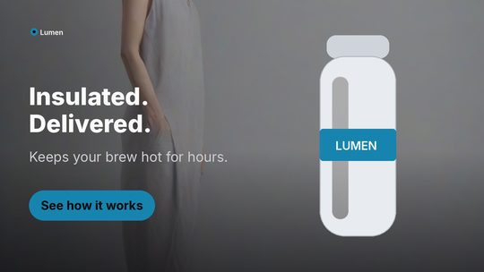
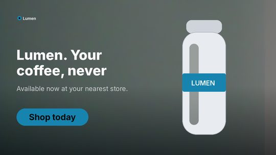
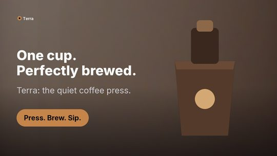
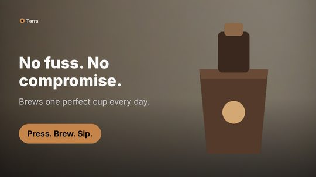
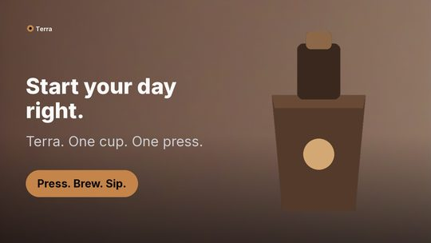

# One pipeline, three brands

Produced by `scripts/diversity.py` on **AMD Radeon Graphics** (torch 2.9.1+gitff65f5b, hip 7.2.53211-e1a6bc5663).

Nothing is configured per brand. The palette is derived from each logo, the copy and
background prompts are written per product, and the same ten checks gate every scene.

| Brand | Verdict | Checks | Receipt |
| --- | --- | ---: | --- |
| Kora Arc | verified | 81/81 | `7f40a605c59d4cd7` |
| Lumen | verified | 81/81 | `40c8083365aa9cc0` |
| Terra | verified | 81/81 | `c71eaa19ba8ccbc1` |

### Kora Arc

### Lumen

### Terra

