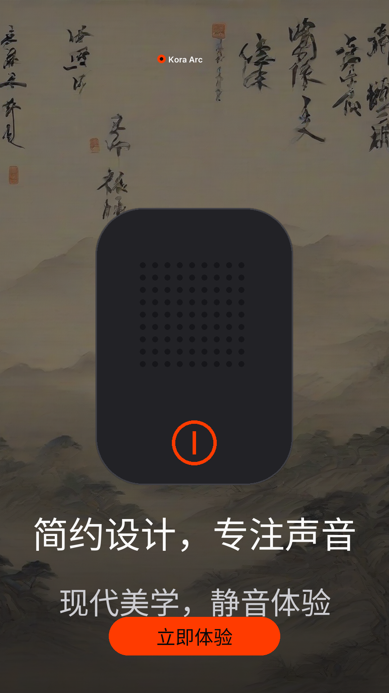
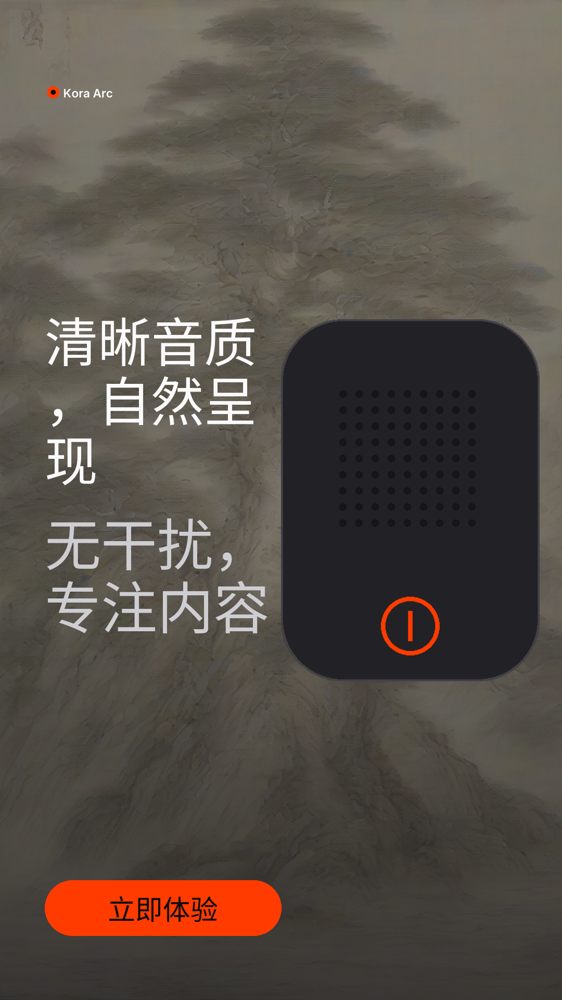
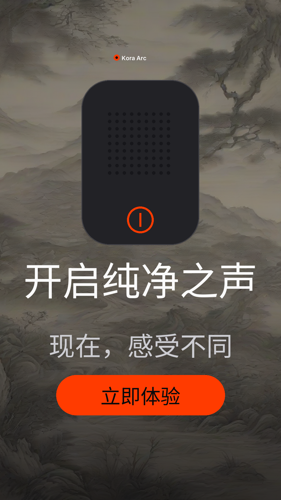

# Rivet results gallery — Mandarin

The same pipeline, run with `--language zh`. The copy is written in Chinese rather than
translated from English, narrated by a Mandarin voice, typeset in a font that carries the
script, and audited against the claims as written.

Produced by `scripts/showcase.py --language zh` on **AMD Radeon Graphics**
(torch 2.9.1+gitff65f5b, hip 7.2.53211-e1a6bc5663).

## Verified campaign

- receipt `54a1402a73e6c7e8`
- **passed: True**
- export pack: written

## Tampered product asset

The product file was altered after the brand confirmed it. A01 compares the hash of the
file actually composited against the hash the brand approved, so the export is refused in
Mandarin exactly as it is in English.

- receipt `bb71a9224d6e2a47`
- **passed: False**
- export pack: withheld
- failing checks:
  - `hook` **A01** — mismatch
  - `proof` **A01** — mismatch
  - `cta` **A01** — mismatch

## What this run cost us

The first Mandarin campaign reported `passed: True` and rendered every Chinese character
as an empty box. The narration stage was told the campaign language and the compositor was
not, so Kokoro spoke Mandarin while Pillow typeset it in a Latin font with no Chinese
glyphs. Nothing in the audit compared a rendered character against the placeholder a font
falls back to, so an unreadable advertisement passed every check.

A11 now refuses copy the packaged font cannot draw, and a test asserts every
language-bearing stage is told the language — it fails without that wiring.
