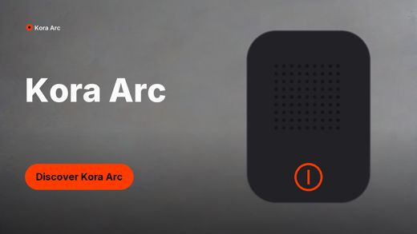
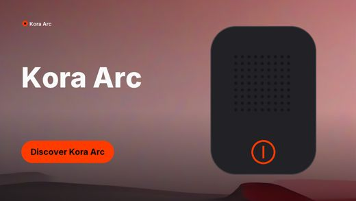
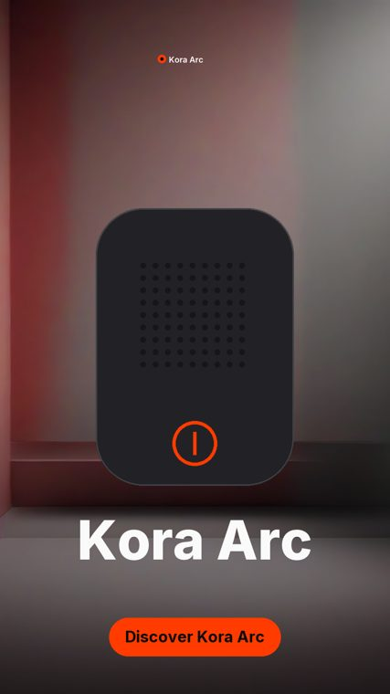
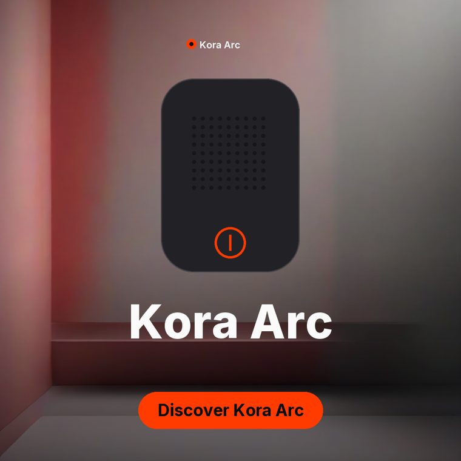
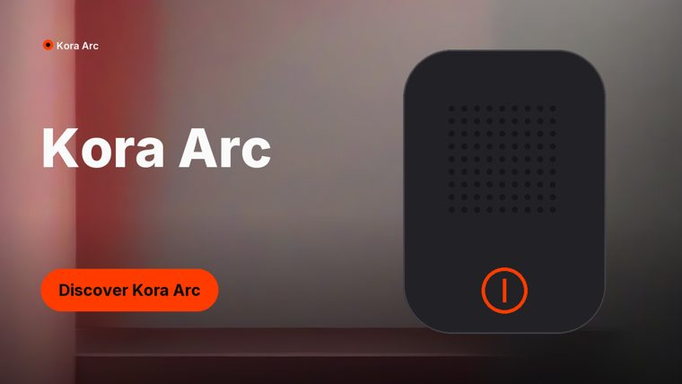

# Rivet results gallery

Produced by `scripts/showcase.py` on **mps** (torch 2.13.0, hip n/a).

## Verified campaign

- receipt `ea72effef9454a4f`
- **passed: True**
- export pack: written

[hero.mp4](hero.mp4)

## Tampered product asset

- receipt `36925ca927f0876a`
- **passed: False**
- export pack: withheld
- failing checks:
  - `hook` **A01** — mismatch
  - `proof` **A01** — mismatch
  - `cta` **A01** — mismatch
  - `hook` **A01** — mismatch
  - `hook` **A01** — mismatch
  - `proof` **A01** — mismatch
  - `proof` **A01** — mismatch
  - `cta` **A01** — mismatch
  - `cta` **A01** — mismatch

[blocked.mp4](blocked.mp4)

## One campaign, three delivery formats

The same scene as a vertical story, a square feed post and a wide banner. Each has its own
composition rather than a squashed crop, and each is audited separately — a legible story
does not smuggle through an illegible banner.

Every export pack carries all nine stills, the assembled video, captions, the receipt and a
manifest hashing each member.
